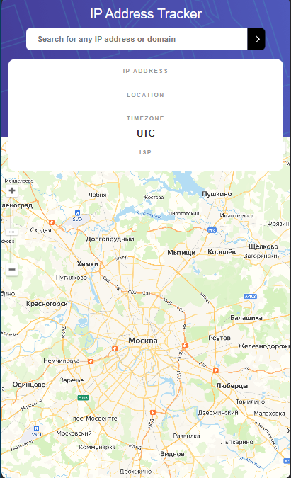

<h1 align="center">Geolocation IP</h1>

## Description

The project was completed as part of the Frontend Mentor Challenges.
This is an IP address tracking app. To get the IP Address locations, I used the [IP Geolocation API] https://ipgeolocation.abstractapi.com. To generate the map I used [API Yandex Maps] https://yandex.com/maps-api/docs/js-api/map/YMap.html. 

## About the project.
- It is implemented to view your own IP address on the map at the initial loading of the page
- Search for any IP addresses or domains and view key information and location

## **Search API address**

## Adaptive design

The interface design is provided for various types of devices.

## **Desktop**

## **Tablet**

## **Validating the submission form and error handling**

## I invite you to see my other projects.
